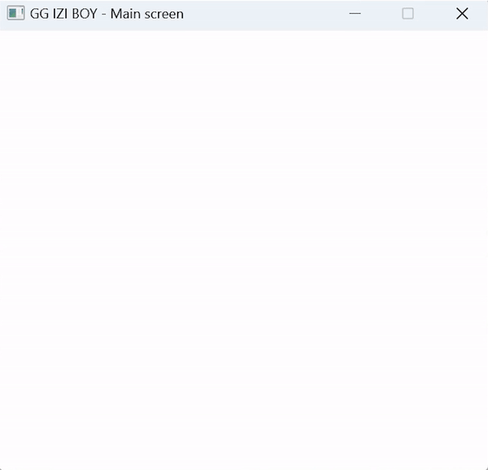

# GGIZIBOY - Game Boy Emulator in Golang

Welcome to GGIZIBoy! GGIZIBoy is a Game Boy emulator written from scratch in the Go programming language (Golang). This project aims to provide an efficient, accurate, and easy-to-understand implementation of the classic Game Boy system.

## Features

| Feature                     | Description                           | Status             |
|-----------------------------|---------------------------------------|--------------------|
| Game Boy CPU emulation      | Emulation of the Game Boy CPU (DMG-01)| :heavy_check_mark: |
| ROM formats support         | Support for Game Boy ROM formats (.gb and .gbc) | :construction: |
| CPU instruction timings     | Accurate emulation of CPU instruction timings | :construction: |
| Interrupt handling          | Proper handling of hardware interrupts | :heavy_check_mark: |
| LCD rendering               | Accurate rendering of the Game Boy LCD display | :heavy_check_mark: |
| Sound generation            | Emulation of the Game Boy sound system | :construction:     |
| Memory banking              | Support for various memory banking techniques | :construction:  |
| Configurable control mappings | Customizable controls for gameplay   | :construction: |
| Save states                 | Save and load the emulator state at any time | :construction:   |

In this table:

:heavy_check_mark: represents a feature that has been implemented.

:construction: represents a feature that is still in development.

# Screenshots

Below are some screenshots and GIFs showcasing GoBoy in action. These images demonstrate the emulator's performance, rendering capabilities, and overall functionality.

<p align="center">
    
</p>

# Getting Started

## Prerequisites

To run GGIZIBoy, you will need:

* Go v1.17 or newer


## Installation

Clone the repository to your local machine:

```sh
git clone https://github.com/arthurlopes/GGIZIBoy.git
```

Change to the GGIZIBoy directory:
```sh
cd GGIZIBoy
```

Build the project:
```sh
go build
```

Run GGIZIBoy:
```sh
./GGIZIBoy [path/to/rom.gb]
```

Replace [path/to/rom.gb] with the path to a Game Boy ROM file.

# Controls

The default control mappings are:

| Key                    | Action                |
|------------------------|-----------------------|
| <kbd>Arrow Up</kbd>    | Move Up               |
| <kbd>Arrow Down</kbd>  | Move Down             |
| <kbd>Arrow Left</kbd>  | Move Left             |
| <kbd>Arrow Right</kbd> | Move Right            |
| <kbd>A</kbd>           | Button A              |
| <kbd>S</kbd>           | Button B              |
| <kbd>Enter</kbd>       | Start                 |
| <kbd>Backspace</kbd>   | Select                |

# Contributing
If you'd like to help improve the emulator, please submit a pull request or open an issue on GitHub.
